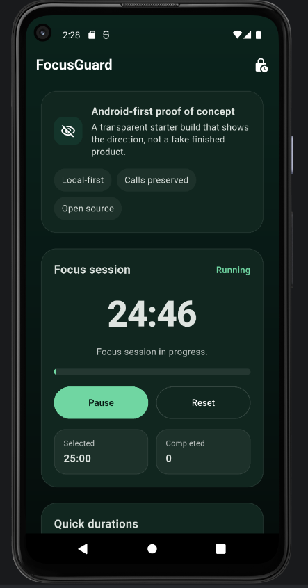
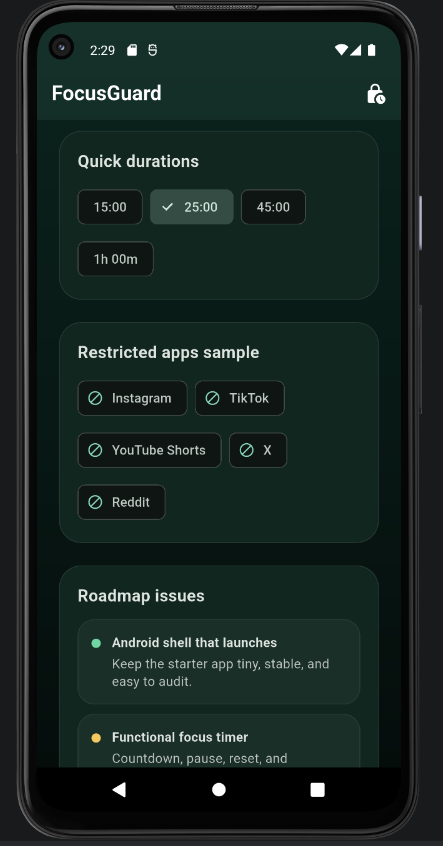

# FocusGuard

FocusGuard is a privacy-first Android focus app prototype built with Flutter.

The goal of this repository is not to pretend the product is finished. It is to show a clear direction, a real Android app that launches, a functional timer, and honest documentation of the limits that remain.

## Current State

- Flutter Android shell that launches
- Functional focus-session timer
- Roadmap issues captured in [`issues.md`](issues.md)
- Contribution and governance docs in [`CONTRIBUTING.md`](CONTRIBUTING.md), [`CODE_OF_CONDUCT.md`](CODE_OF_CONDUCT.md), and [`LICENSE`](LICENSE)

## What the app does now

- Lets the user pick a focus duration
- Starts, pauses, and resets a countdown
- Shows a small sample of apps that would later become restricted
- Displays the near-term roadmap directly in the UI
- Keeps session data local to the app state for now

## What is intentionally not done yet

- Real app blocking
- Installed-app enumeration
- Permission onboarding
- Local persistence
- Session restoration after restart
- Accessibility hardening

Those items are still on the roadmap and should be implemented incrementally.

## Roadmap

Open the issue seed list in [`issues.md`](issues.md). It contains the first 8 issues I would file for the project:

- Android proof-of-concept scope
- local session persistence
- app-selection screen
- permission explanations
- restriction screen prototype
- battery and OEM limitations
- session history
- accessibility and emergency-exit safeguards

## Demo

Short walkthrough:

1. Open the app on Android.
2. Choose a duration such as 15 or 25 minutes.
3. Tap `Start`.
4. Watch the countdown and progress bar move.
5. Tap `Pause` or `Reset` to stop the session.

## Preview

  
  

For a narrative demo, see [`demo.md`](demo.md).

## Repository Layout

- [`lib/main.dart`](lib/main.dart): the Flutter prototype UI and timer logic
- [`android/`](android): the Android host app
- [`preview/`](preview): current Android preview screenshots
- [`issues.md`](issues.md): the roadmap issue seed list
- [`demo.md`](demo.md): short demo walkthrough
- [`CONTRIBUTING.md`](CONTRIBUTING.md): contribution workflow
- [`CODE_OF_CONDUCT.md`](CODE_OF_CONDUCT.md): community standards

## Running locally

1. Install Flutter.
2. From the repository root, run `flutter pub get`.
3. Run `flutter test`.
4. Launch the app on an Android emulator or device with `flutter run`.

## Open-source stance

FocusGuard is a personal productivity tool controlled by the device owner. It should remain transparent about permissions, local data, and the practical limits of Android app control.
